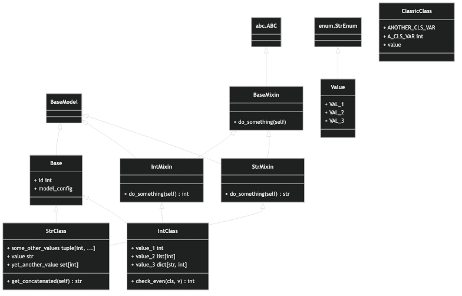

touml
=====

> pronounced /ˈtoo͞m.əl/

A CLI, written in Rust, that converts Python classes to a unified Mermaid diagram.

## Installation

```shell
pip install touml

# OR (better yet)
uv pip install touml
```

## Usage

```shell
# Print help
touml --help

# Print output to stdout
touml path/to/python/files

# Generate an `out.mmd` file in the current directory
touml path/to/python/files -o .

# Print output, but exclude classes, files, and subdirectories matching globs.
touml path/to/python/files --exclude-files "**/__init__.py" "**/config.py" --exclude-dirs "tests" --exclude-classes "Base*"
```

## Tips

```shell
# Pipe outputs to `less` to scroll outputs
$ touml path/to/python/files | less

# Pipe outputs to `mmdc` to generate images
$ touml path/to/python/files | mmdc -i -o out.png

# Copy outputs to clipboard
$ touml path/to/python/files | pbcopy
```

## Examples

```shell
# Convert all Python files in the test directory to Mermaid diagrams
$ touml tests

classDiagram

    class StrClass {
        + some_other_values tuple[int, ...]
        + value str
        + yet_another_value set[int]
        + get_concatenated(self) str
    }

    Base <|-- StrClass
    StrMixin <|-- StrClass


    class IntClass {
        + value_1 int
        + value_2 list[int]
        + value_3 dict[str, int]
        + check_even(cls, v) int
    }

    Base <|-- IntClass
    IntMixin <|-- IntClass


    class Value {
        + VAL_1
        + VAL_2
        + VAL_3
    }

    `enum.StrEnum` <|-- Value


    class ClassicClass {
        + ANOTHER_CLS_VAR
        + A_CLS_VAR int
        + value
    }


    class Base {
        + id int
        + model_config
    }

    BaseModel <|-- Base


    class BaseMixin {
        + do_something(self)
    }

    `abc.ABC` <|-- BaseMixin


    class IntMixin {
        + do_something(self) int
    }

    BaseMixin <|-- IntMixin
    BaseModel <|-- IntMixin


    class StrMixin {
        + do_something(self) str
    }

    BaseMixin <|-- StrMixin
    BaseModel <|-- StrMixin

```

Pipe the above to `mmdc -i - -t dark -b transparent`, and you get:


## FAQs

### What's Mermaid?
Mermaid is a diagramming and charting tool that produces neat diagrams from text. You can learn more about it [here](https://mermaid-js.github.io/mermaid/).

### This tool doesn't generate images!
You're right, young padawan. This tool, intentionally, only generates Mermaid diagram code.
To generate images, you can pipe the output to `mmdc` (the official Mermaid CLI).
To download `mmdc`, take a look at their [docs](https://github.com/mermaid-js/mermaid-cli?tab=readme-ov-file#installation).

Once installed, you can try something like this:

```shell
$ touml path/to/python/files | mmdc -i -o out.png
```

### I don't need images, I just want to see the diagrams!
You can copy the output to your clipboard and paste it in a Markdown file,
Draw.io, or any other tool that supports Mermaid diagrams.

```shell
$ touml path/to/python/files | pbcopy
```

### Why Rust?
The idea was to make `touml` invocable from a CI pipeline, and we all know how much we want those to be fast.

### Sure, but how fast is it?
Blazingly fast, of course. For anecdotal evidence, where I accidentally executed `touml` against my current directory (including my virtual environment), I was able to generate Mermaid output for 427 Python files in 0.72 seconds. Not convinced? Try it out yourself!

### How does it work?
Easy.
1. Parse all Python files in a given directory, minus those that a user wants to exclude.
2. Extract all classes and their attributes, using the Python AST.
3. Generate a Mermaid diagram from the extracted classes and attributes.

### Does `touml` support other languages?
At present, no: `touml` only generates Mermaid from Python. However, so long as there's a data model that `impl`s the `MermaidAdapter` trait, sky's the limit.
